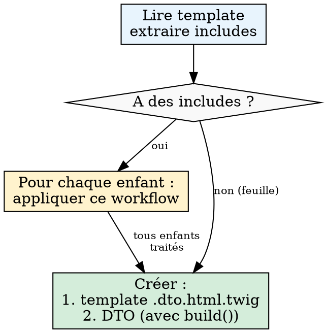

# Dayuse Mail — Pattern DTO

## Overview

Pattern de modernisation des emails transactionnels Dayuse : remplacer les tableaux non structurés (`reservationData`, `array<string, mixed>`) par des DTO PHP strictement typés (`final readonly class`) avec méthode `build()` statique, et des templates `.dto.html.twig` à zéro logique métier.

## Quand utiliser ce Skill

- Refactoring d'anciens templates d'emails transactionnels (`.html.twig`).
- Migration de templates vers l'extension `.dto.html.twig`.
- Remplacement du tableau global non structuré `reservationData` (et des autres tableaux `array<string, mixed>`) par des DTO spécifiques avec des propriétés typées.
- Mise à jour des Notifiers (`ConfirmationEmailNotifier`, etc.) pour utiliser les DTOs et leur méthode `build()`.

### Quand NE PAS utiliser

- Emails marketing ou newsletters (gérés par un autre système).
- Templates purement statiques (aucune variable Twig : ni `{{ var }}`, ni ``, ni paramètre reçu via `include`).
- Modification d'un template `.html.twig` existant qui n'est pas en cours de migration (ne pas casser les anciens emails).

## État actuel de la migration

La migration est **en cours**. Le nouveau pattern est appliqué aux templates enfants (`_parts/`) ; les templates racine suivent encore l'ancien pattern.

| Composant | État | Remarques |
|-----------|------|-----------|
| Part DTOs (`PartDTO/`) | Fait | `BookingHeaderBlockDTO`, `BookingInfosReinsuranceDTO`, `BookingInfosReinsuranceItemDTO` — **patterns de référence** |
| Part Templates (`.dto.html.twig`) | Fait | `booking_header_block.dto.html.twig`, `reinsurance.dto.html.twig`, `reinsurance_item.dto.html.twig` — **patterns de référence** |
| Root DTOs (`DTO/`) | Legacy | `R7OrderConfirmedHotelEmailDTO`, etc. — ancien nommage, `__toArray()`, `reservationData: array`. **Ne pas s'en inspirer.** |
| Root Templates (`.dto.html.twig`) | À créer | Templates racine encore en `.html.twig` |
| Notifiers | À migrer | Utilisent encore `$dto->__toArray()` |

**Important** : les DTOs racine legacy (`R7OrderConfirmedHotelEmailDTO`, `R9CancellationEmailDTO`, `R11OrderUpdateCustomerEmailDTO`, `R12OrderUpdateHotelEmailDTO`) utilisent l'ancien pattern (`private` properties, `__toArray()`, `reservationData: array<string, mixed>`). Ne **jamais** s'en inspirer pour créer de nouveaux DTOs. S'inspirer uniquement des Part DTOs.

## Modèles de référence

Fichiers existants à utiliser comme modèle lors de la création de nouveaux DTOs/Templates :

| Type | Fichier de référence |
|------|---------------------|
| DTO enfant | `src/Email/DTO/PartDTO/BookingHeaderBlockDTO.php` |
| Template enfant | `templates/transactional-emails/_parts/booking_header_block.dto.html.twig` |
| DTO racine | Voir `reference.md` (pas encore de référence dans le code) |

Exemples de code complets dans `reference.md`.

## Contexte : Ancien vs Nouveau Pattern

| Critère | Ancien pattern | Nouveau pattern (cible) |
|---|---|---|
| Extension template | `.html.twig` | `.dto.html.twig` |
| Variable Twig | `reservationData.xxx`, `language`, etc. (variables plates) | `data.xxx` (une seule variable typée) |
| Passage au template | `$dto->__toArray()` | `['data' => $dto]` |
| Propriétés DTO | `reservationData: array<string, mixed>` | Propriétés typées (ex: `bookingNumber: string`) |
| Logique dans Twig | Conditions complexes possibles | Zéro logique métier, résultats booléens pré-calculés |
| Construction DTO | Manuelle dans le Notifier | Méthode statique `build()` dans le DTO |
| Paramètres `build()` | `array $reservationData` (non typé) | Objets métier : `Order`, `Hotel`, `Language`, etc. |

## Quick Reference

| Élément | Convention |
|---------|-----------|
| Extension template | `.dto.html.twig` |
| Variable extérieure à Twig | `data` (uniquement) |
| Typage template | `{# @var data \Dayuse\Email\DTO\XxxDTO #}` |
| DTO racine | `src/Email/DTO/` |
| DTO enfant | `src/Email/DTO/PartDTO/` |
| Passage au template | `['data' => $dto]` |
| Classe DTO | `final readonly class` |
| Propriétés DTO | `public` uniquement |
| Construction DTO | `public static function build(...)` dans le DTO |
| Paramètres `build()` | Objets métier (`Order`, `Hotel`, etc.) ou scalaires — **jamais** `array` |

## Principes Fondamentaux & Workflow

### 0. Stratégie Depth-First (Feuilles d'abord)

**Principe cardinal : toujours scanner récursivement PUIS traiter les feuilles avant les parents.**

**AVANT toute création de fichier**, scanner récursivement le template donné : lire le contenu, extraire tous les `include`, descendre dans chaque enfant, et construire l'arbre complet. **Afficher l'arbre avant de commencer tout travail.** Sans ce scan, le DTO parent sera incomplet (enfants manquants).

**Règle d'éligibilité : tout template contenant des variables Twig doit être traité (paire `.dto.html.twig` + DTO).**

Un template est éligible dès qu'il **reçoit ou utilise des variables Twig**, quelle que soit leur origine :
- Variables issues de `reservationData` ou d'autres tableaux PHP.
- Variables passées via les paramètres d'un `include` (ex: `{ imgUrl: ..., text: ... }`).
- Variables du scope parent.

> **Piège courant** : un template "feuille" comme `reinsurance_item.html.twig` peut sembler ne pas nécessiter de migration (pas d'`include`, pas de `reservationData`), mais s'il reçoit des variables (`imgUrl`, `text`, `isBlack`) via les paramètres d'un `include`, il **doit** être traité.

Commencer par les feuilles (templates sans `include`) et remonter vers la racine.



**Cet ordre s'applique à chaque couche :**

| Étape | Ordre |
|-------|-------|
| Templates | Feuille `.dto.html.twig` → … → Racine `.dto.html.twig` |
| DTOs | DTO feuille → … → DTO racine (qui imbrique les enfants) |

**Workflow récursif pour un template donné :**

1. Lire le template : lister tous les `include` **ET** toutes les variables Twig utilisées (`{{ var }}`, ``, paramètres reçus via `include`).
2. Pour chaque enfant inclus, appliquer récursivement ce même workflow (étape 1).
3. Une fois **tous les enfants traités** (template `.dto.html.twig` + DTO créés), traiter le parent :
   - Créer le template parent `.dto.html.twig` (qui `include` les enfants déjà migrés).
   - Créer le DTO parent (qui référence les DTOs enfants comme propriétés typées et dont la méthode `build()` appelle `ChildDTO::build()` pour chaque enfant).

**Exemple — Arbre à 3 niveaux :**

```
r7-confirmed.html.twig                          ← racine (reservationData, language, ...)
  ├── _parts/booking_header_block.html.twig      ← enfant (title, subtitle, ...)
  │     └── _parts/reinsurance.html.twig         ← enfant (reservationData, ...)
  │           └── _parts/reinsurance_item.html.twig ← feuille ×N (imgUrl, text, isBlack)
  └── _parts/payment_summary.html.twig           ← feuille (totalPrice, currency)
```

**×N** signifie que le template est inclus **plusieurs fois** dans son parent avec des données différentes à chaque appel. Voir la section [DTO enfant instancié plusieurs fois](#dto-enfant-instancié-plusieurs-fois-n-instances).

**Ordre de traitement :**
1. `reinsurance_item` (feuille ×N) → `BookingInfosReinsuranceItemDTO`
2. `reinsurance` (ses enfants sont faits) → `BookingInfosReinsuranceDTO`
3. `booking_header_block` (ses enfants sont faits) → `BookingHeaderBlockDTO`
4. `payment_summary` (feuille) → `PaymentSummaryDTO`
5. `r7-confirmed` (tous ses enfants sont faits) → `R7DTO`

**Interdit (depth-first) :**
- Créer un fichier (template, DTO) sans avoir scanné récursivement les `include` d'abord.
- Ignorer un `include` trouvé dans un template.
- Ignorer un template enfant sous prétexte qu'il ne contient pas de `reservationData` — s'il a des variables, il doit être traité.
- Créer un DTO parent avant que ses DTOs enfants existent.
- Créer un template `.dto.html.twig` qui `include` un enfant **avec variables** non encore migré (`.html.twig`). Les templates statiques (sans variables Twig) restent en `.html.twig`.

### 1. Templating (`.dto.html.twig`)

- **Convention de nommage** : Suffixe `.dto.html.twig` (ex: `r7-confirmed.dto.html.twig`, `manage_cb_block.dto.html.twig`).
- **Ne jamais modifier** ou **supprimer** les templates originaux `.html.twig` — les créer à côté en `.dto.html.twig`.
- **Fidélité structurelle** : Le template `.dto.html.twig` doit conserver la même structure HTML et la même logique d'affichage que l'original. On remplace les accès `reservationData.xxx` par `data.xxx`, les comparaisons de constantes PHP (`constant(...)`) par des booléens du DTO, et les variables plates par des propriétés DTO — mais on ne réécrit pas la structure du template. Les `include` restent des `include` (vers les versions `.dto.html.twig`), les boucles restent des boucles, etc.
- **Typage PHP DocBlock** : Toujours typer `data` en première ligne du fichier :

```twig
{# @var data \Dayuse\Email\DTO\PartDTO\BookingHeaderBlockDTO #}
```

- Un seul typage par template. La variable est **toujours** nommée `data`.
- **Zéro logique métier** : Pas de calcul, pas de condition complexe. Les filtres Twig de formatage sont autorisés (`format_date`, `formatPrice`, `trans`, etc.).
- **Accès aux données** : `data.bookingNumber`, `data.hotelName`, `data.isPrepaid`, etc.
- **Logique déportée en PHP** : Les conditions Twig complexes deviennent des booléens sur le DTO.
- Les templates ont la responsabilité de traduire les clés de traduction.
- Toutes les données utilisées dans le template sont déclarées dans le DTO du template, ou initialisées dans le template lui-même (via `` avec logique calculée).
- Les variables déclarées avec `` sont obligatoirement utilisées dans le template.
- Interdit : initialiser une variable sans logique ajoutée.

```twig
{# OK — set avec logique calculée #}


{# INTERDIT — set sans valeur ajoutée #}

```

### 2. Imbrication & Templates Enfants

Lorsqu'un template parent inclut un composant enfant, passer explicitement le DTO imbriqué :

```twig
{{ include('@emails/_parts/booking_header_block.dto.html.twig', { data: data.bookingHeader }) }}
```

- Dupliquer `_parts/xyz.html.twig` → `_parts/xyz.dto.html.twig` et refactoriser le nouveau.
- Ne jamais modifier l'original pour ne pas casser les anciens emails qui en dépendent.

#### DTO enfant instancié plusieurs fois (N instances)

Quand un template parent inclut le **même template enfant N fois** avec des données différentes, le DTO parent déclare **une propriété typée par instance** du DTO enfant (nullable si conditionnelle). La méthode `build()` du DTO parent appelle `ChildDTO::build()` **une fois par instance**.

La règle « un DTO = un seul template » s'applique au **type** de DTO, pas au nombre d'instances. `ReinsuranceItemDTO::build()` peut être appelé N fois pour produire N instances de `ReinsuranceItemDTO`.

Voir `reference.md` section "DTO enfant instancié N fois" pour l'exemple complet (DTO + template).

### 3. Data Transfer Objects (DTOs)

**Deux types de DTO :**
- **DTO racine** — appliqué au template appelé depuis une classe PHP.
- **DTO enfant** — déclaré par un DTO racine ou un autre DTO enfant.

**Emplacements :**
- DTO racine (template principal) : `src/Email/DTO/`
- DTO enfant (template `_parts/`) : `src/Email/DTO/PartDTO/`

**Structure obligatoire :**

```php
// Exemple simplifié — voir reference.md pour l'exemple complet

/**
 * @see templates/transactional-emails/hotel/reservation/r7-confirmed.dto.html.twig
 */
final readonly class R7DTO
{
    public function __construct(
        public string $bookingNumber,
        public bool $isPrepaid,
        public BookingHeaderBlockDTO $bookingHeader,
        public ?string $taxInformation,
    ) {
    }

    public static function build(Order $order, Hotel $hotel, Language $language): self
    {
        // ... assemblage des données
        return new self(
            bookingNumber: $order->getBookingNumber(),
            isPrepaid: $order->isPrepaid(),
            bookingHeader: BookingHeaderBlockDTO::build($order, $hotel, $language),
            taxInformation: $hotel->willCollectLocalSalesTax() ? 'email.tax.information' : null,
        );
    }
}
```

Voir `reference.md` pour les exemples complets de DTO racine et enfant.

**Règles :**
- `final readonly class` — toujours.
- **Propriétés `public`** — obligatoire pour que Twig puisse y accéder via `data.property`.
- Typage natif PHP sur chaque propriété. Pas de `array<string, mixed>`, pas de `mixed`.
- Les noms de propriétés correspondent exactement aux noms utilisés dans le template.
- Pas de traduction dans le DTO — uniquement les clés de traduction sous forme de `string`. La méthode `build()` construit ces clés et leurs paramètres ; le template les traduit avec `|trans`.
- Un DTO = un seul template.
- Indique en commentaire `@see` le template auquel il s'applique.
- Pas de tableau, uniquement des objets, qui seront dans le dossier `src/Email/DTO/`.

#### Méthode `build()` statique

Chaque DTO contient une méthode `public static function build(...)` qui assemble le DTO à partir des objets métier.

**Règles de `build()` :**
- Paramètres : objets métier (`Order`, `Hotel`, `DomainConfig`, `Language`, `OrderItem`, etc.) ou scalaires sans calcul préalable.
- **Préférer les objets entiers aux scalaires pré-extraits** — quand un `build()` a besoin de plusieurs propriétés d'un même objet, passer l'objet entier. C'est le `build()` du DTO qui extrait ce dont il a besoin, pas l'appelant. Les scalaires sont réservés aux valeurs qui ne proviennent pas d'un objet métier unique (flags, URLs calculées, clés de traduction).
- **Construction récursive depth-first** : la méthode `build()` du DTO parent appelle `ChildDTO::build()` pour chaque DTO enfant. Un DTO ne construit **jamais** un DTO enfant directement via `new ChildDTO(...)` — il délègue toujours à `ChildDTO::build()`.
- **Pas de traduction dans `build()`** — ne jamais appeler `->trans()`. En revanche, `build()` **peut et doit** construire des clés de traduction (`string`) et leurs paramètres pour que le template puisse les traduire avec `|trans`.
- **Calculs dupliqués acceptés** : si deux DTOs distincts ont besoin de la même information calculée (ex: `isPrepaidPayment`), chaque `build()` calcule cette information indépendamment. On ne partage pas de données calculées entre DTOs.

#### Préférer les objets entiers aux scalaires pré-extraits

Quand un DTO a besoin de plusieurs propriétés d'un même objet métier, passer **l'objet entier** au `build()`. Chaque DTO est responsable d'extraire les données dont il a besoin — ce n'est pas le rôle du parent de décomposer l'objet en scalaires.

```php
// ❌ ÉVITER — le parent pré-extrait tous les scalaires
HotelInformationDTO::build(
    hotelName: $hotel->getName(),
    hotelAddress: $hotel->getAddress(),
    hotelRating: $hotel->getStarRating(),
    hotelUrl: $hotel->getUrl(),
    contactPhoneNumber: $domainConfig->getContactPhoneNumber(),
);

// ✅ PRÉFÉRER — passer les objets, le DTO extrait lui-même
HotelInformationDTO::build(
    hotel: $hotel,
    domainConfig: $domainConfig,
);
```

**Pourquoi :**
- **Signatures propres** : 2 paramètres au lieu de 6. Le parent n'a pas à connaître les détails internes du DTO enfant.
- **Encapsulation** : si le DTO enfant a besoin d'un champ supplémentaire demain, seul son `build()` change — pas tous les appelants.
- **Évite la tentation du tableau** : quand le parent doit pré-extraire 10+ scalaires, la tentation de passer un `array` à la place est forte. Passer l'objet entier élimine ce besoin.

**Quand utiliser des scalaires :**
- Valeurs qui ne proviennent pas d'un objet unique : flags (`isForHotel`, `isActive`), URLs calculées, clés de traduction (`$title`, `$subtitle`).
- Valeur provenant d'un seul getter isolé (ex: `string $locale` extrait de `Language::getLocale()`).

#### INTERDIT — `reservationData` et tableaux non typés dans `build()`

**Aucun DTO (racine OU enfant) ne doit accepter `array $reservationData` ou `array<string, mixed>` en paramètre de `build()`.** C'est le problème exact que cette migration résout — un tableau non structuré et non typé. Le remplacer par un autre tableau non structuré ne résout rien.

**Ceci s'applique à TOUS les DTOs — y compris le DTO racine.** Le fait que le Notifier utilise `reservationData` en interne ne justifie pas de le passer au DTO. Le DTO racine doit recevoir les objets métier et extraire les données lui-même.

```php
// ❌ INTERDIT — tableau non typé en paramètre
public static function build(array $reservationData, string $locale): self
{
    return new self(
        bookingNumber: $reservationData['bookingNumber'],     // ← pas de typage
        hotelName: $reservationData['hotel']['name'],          // ← accès imbriqué fragile
    );
}

// ❌ INTERDIT — même si le tableau est enrichi/transformé
$reservationDataEnriched = $reservationData;
$reservationDataEnriched['checkinDateFormatted'] = $formatted;
BookingDetailsBlockDTO::build(reservationData: $reservationDataEnriched);

// ❌ INTERDIT — même un sous-ensemble du tableau
public static function build(array $hotelData): self  // ← toujours un array<string, mixed>

// ✅ CORRECT — objets métier typés
public static function build(Order $order, Hotel $hotel, Language $language): self
{
    $orderItem = $order->getParentOrderItem();
    return new self(
        bookingNumber: $order->getBookingNumber(),
        hotelName: $hotel->getName(),
    );
}
```

**Rationalisations courantes (toutes invalides) :**

| Excuse | Réalité |
|--------|---------|
| "Le Notifier utilise déjà `reservationData`, c'est plus simple de le passer" | Le but de la migration est justement d'éliminer `reservationData`. Le DTO racine reçoit `Order`, `Hotel`, `Language` depuis le Notifier. |
| "Le DTO racine est différent, il peut accepter le tableau" | Non. Aucun DTO — racine ou enfant — n'accepte de tableau. Le DTO racine est le point d'entrée de la migration : il reçoit les entités et les distribue aux enfants. |
| "Je ne fais que transiter le tableau, ce n'est pas moi qui appelle `getInfo()`" | `$reservationData` EST le résultat de `getInfo()`. Le transiter revient à perpétuer l'ancien pattern. |
| "C'est temporaire, on refactorera plus tard" | Non. Le DTO est créé une fois, correctement, avec des objets métier. |
| "Il y a trop de champs à extraire des entités" | Les entités exposent des getters typés. C'est plus de code initial, mais c'est le but : remplacer les accès `['key']` par des appels typés. |

**Red flags — STOP et corriger :**
- `array $reservationData` dans une signature `build()`
- `array<string, mixed>` dans un `@param` de `build()`
- `$reservationData['xxx']` dans le corps d'un `build()`
- Un DTO parent qui enrichit un tableau avant de le passer à un enfant
- Un `build()` qui prend un tableau et en extrait des sous-clés (`$data['hotel']['name']`)

#### Nommage

Le DTO reprend le nom du template sur lequel il s'applique, en PascalCase, suffixé par `DTO`.

| Template | DTO |
|---|---|
| `hotel/reservation/r7-confirmed.dto.html.twig` | `R7DTO` |
| `customer/reservation/r9-cancelled.dto.html.twig` | `R9CancelledDTO` |
| `_parts/booking_header_block.dto.html.twig` | `BookingHeaderBlockDTO` |
| `_parts/payment/_parts/inclusive_taxes.dto.html.twig` | `PaymentInclusiveTaxesDTO` |

> **Attention legacy** : les DTOs racine existants (`R7OrderConfirmedHotelEmailDTO`, `R9CancellationEmailDTO`, etc.) suivent un ancien nommage verbose. Les **nouveaux** DTOs doivent suivre la convention ci-dessus. Lors de la migration complète d'un template racine, créer un nouveau DTO avec le bon nommage.

### 4. Notifiers

Remplacer le passage de `$dto->__toArray()` par `['data' => $dto]` :

```php
// Avant : $dto->__toArray() + template .html.twig
->withBody('@emails/.../r7-confirmed.html.twig', $dto->__toArray())

// Après : DTO::build() + template .dto.html.twig
$dto = R7DTO::build($order, $hotel, $language);
->withBody('@emails/.../r7-confirmed.dto.html.twig', ['data' => $dto])
```

- Voir `reference.md` section "Notifier — Avant / Après" pour l'exemple complet.

## Checklist de migration d'un email

### Phase 1 — Cartographie (top-down) — OBLIGATOIRE AVANT TOUT CODE

**Appliquer le scan récursif décrit dans la section "Stratégie Depth-First" ci-dessus.**

1. [ ] Scanner récursivement le template racine (`.html.twig`) et **afficher l'arbre complet** (avec les variables de chaque template et la notation ×N si un enfant est inclus plusieurs fois).
2. [ ] Identifier toutes les variables Twig utilisées dans **chaque** template de l'arbre (y compris `reservationData`, variables passées via `include`, et variables du scope parent). Tout template avec des variables doit être traité.

### Phase 2 — Construction récursive (bottom-up, feuilles d'abord)

**Pour chaque template, en partant des feuilles et en remontant vers la racine :**

3. [ ] Créer le template `.dto.html.twig` (copie refactorisée) — ne pas modifier l'original.
4. [ ] Créer le DTO correspondant avec sa méthode `build()` statique (`src/Email/DTO/PartDTO/` pour les enfants, `src/Email/DTO/` pour la racine).
5. [ ] Si le template a des enfants : vérifier que le DTO référence les DTOs enfants comme propriétés typées et que sa méthode `build()` appelle `ChildDTO::build()` pour chaque enfant.

**Répéter les étapes 3-5 en remontant l'arbre jusqu'au template racine.**

### Phase 3 — Intégration

6. [ ] Mettre à jour le Notifier pour appeler `RootDTO::build(...)` et passer `['data' => $dto]`.
7. [ ] Vérifier PHPStan niveau 10 (`inv phpstan`).
8. [ ] Vérifier le lint Twig (`inv lint`).

## Erreurs fréquentes

| Erreur | Correction |
|--------|-----------|
| `private string $bookingNumber` dans le DTO | `public string $bookingNumber` — Twig ne peut pas accéder aux propriétés privées |
| S'inspirer des DTOs racine legacy (`R7OrderConfirmedHotelEmailDTO`) | Ces DTOs suivent l'ancien pattern (`__toArray()`, `reservationData: array`). S'inspirer des Part DTOs (`BookingHeaderBlockDTO`) |
| `build()` appelle `OrderInfoViewModelBuilder::getInfo()` | `build()` reçoit `Order`, `Hotel`, `Language` en paramètre direct |
| `build(array $reservationData)` — tableau non typé en paramètre | **Interdit.** `build()` reçoit des objets métier (`Order`, `Hotel`, etc.) — jamais de `array<string, mixed>`. Voir section "INTERDIT — `reservationData`" |
| `$reservationData['hotel']['name']` dans un `build()` | Remplacer par `$hotel->getName()`. Les accès par clé de tableau sont le problème que la migration résout |
| DTO racine qui accepte `array $reservationData` "parce que le Notifier l'utilise" | Le DTO racine reçoit les entités depuis le Notifier et extrait les données via les getters. Le Notifier ne passe plus `reservationData` au DTO |
| `build(string $hotelName, string $hotelAddress, int $hotelRating, ...)` — scalaires pré-extraits d'un même objet | Passer l'objet entier : `build(Hotel $hotel, ...)`. Le DTO extrait lui-même via `$hotel->getName()`, etc. Voir section "Préférer les objets entiers" |
| Template enfant inclus sans passer le sous-DTO | `{ data: data.bookingHeader }` — toujours passer le DTO enfant explicitement |
| `` sans logique | Supprimer — les `` sans valeur ajoutée sont interdits |
| Méthode d'entité devinée (ex: `getStars()`) | Vérifier l'entité réelle — ex: `$hotel->getStarRating()` |
| `build()` du DTO parent construit un DTO enfant avec `new ChildDTO(...)` | Toujours déléguer à `ChildDTO::build()` — jamais de `new ChildDTO(...)` dans le `build()` du parent |
| Template `.dto.html.twig` restructuré (logique d'affichage réécrite) | Conserver la même structure HTML que l'original — remplacer les accès `reservationData` par `data.xxx` et les `constant(...)` par des booléens, sans réécrire la structure |
| DTO enfant créé mais jamais instancié en PHP | Tout DTO doit être instancié par sa méthode `build()` et référencé comme propriété typée dans le DTO parent |
| Template enfant avec variables non migré (ex: `reinsurance_item.html.twig` ignoré) | Tout template recevant des variables (même via paramètres d'`include`) doit être migré — créer `.dto.html.twig` + DTO |
| DTO enfant utilisé une seule fois alors que le template est inclus N fois | Déclarer une propriété typée **par instance** dans le DTO parent — `ChildDTO::build()` est appelé N fois |
| Template `.dto.html.twig` inclut un enfant **avec variables** non migré (`.html.twig`) | Tous les enfants avec variables doivent être migrés d'abord. Les templates statiques (sans variables) restent en `.html.twig` |
| Hash Twig inline au lieu d'un DTO enfant : `{ data: { imgUrl: '...', text: '...' } }` | Passer une instance DTO : `{ data: data.childProperty }`. Les hashes inline contournent le typage PHP et le pattern `ChildDTO::build()` |
